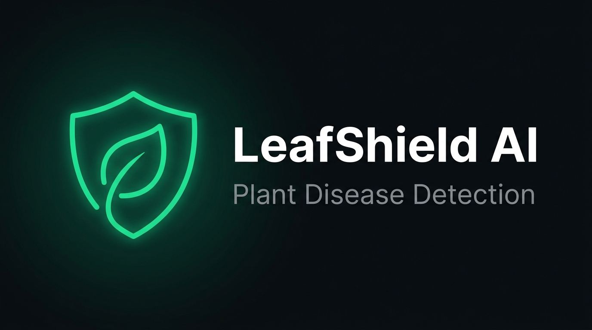
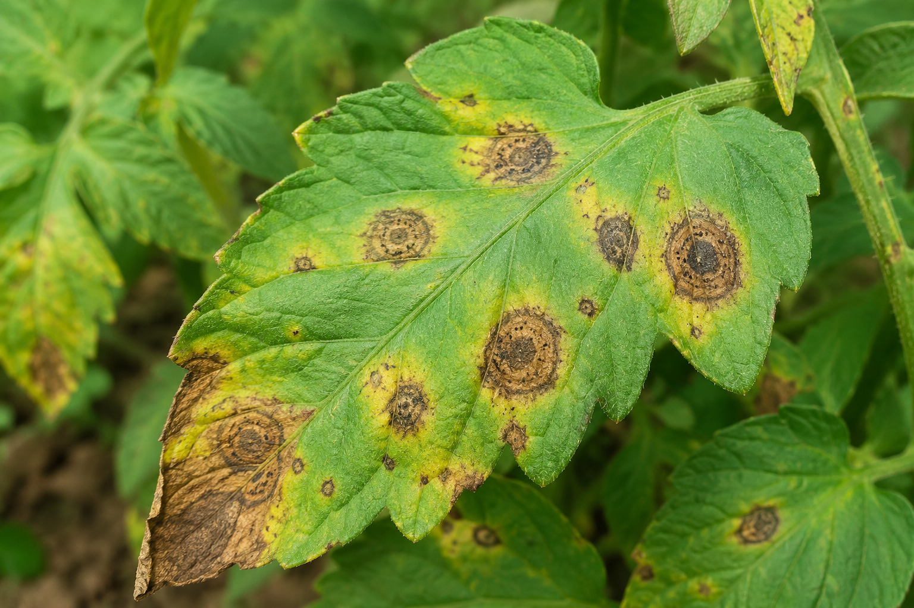
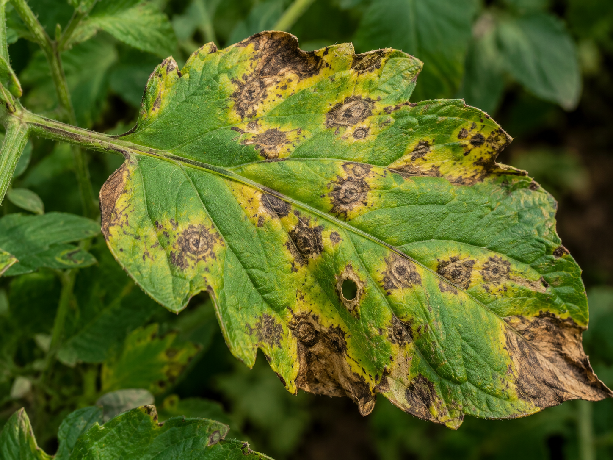

<p align="center">
  
</p>

<h1 align="center">🛡️ LeafShield AI</h1>

<p align="center">
  <b>Instant Plant Disease Detection Powered by Deep Learning</b>
</p>

<p align="center">
  
  
  
  
  
  
</p>

<p align="center">
  
  
  
  
  
</p>

---

Upload a photo of a plant leaf → get an instant diagnosis with confidence score → receive actionable care recommendations.

LeafShield AI uses a fine-tuned **MobileNetV3 Large** convolutional neural network trained on the [PlantVillage](https://huggingface.co/datasets/geraldmc/plantvillage-full) dataset to classify **38 disease/healthy conditions** across **14 crop species** — all running locally on your machine.

<br/>

<p align="center">
  
  &nbsp;&nbsp;
  
</p>
<p align="center"><i>Example diseased plant leaves that the model can diagnose</i></p>

---

## ✨ Features

| Feature | Description |
|---|---|
| 🎨 **Glassmorphic UI** | Dark-themed responsive interface with emerald accent glows, smooth hover animations, and premium card components |
| 📤 **Drag & Drop Upload** | Upload leaf images via drag-and-drop or click-to-browse file picker |
| 🧠 **High-Accuracy Model** | MobileNetV3 Large backbone with **99.6% training** and **95.6% validation** accuracy |
| 📊 **Confidence Meter** | Animated progress bar displaying the model's prediction confidence |
| 💊 **Care Recommendations** | Context-aware treatment plans based on the specific disease detected (blight, rust, mildew, virus, pests, etc.) |
| ⚡ **Fast Inference** | Predictions in under 100ms on CPU — no GPU required |
| 🌿 **38 Conditions** | Covers Apple, Tomato, Potato, Grape, Corn, Pepper, Cherry, Peach, Strawberry, Orange, Soybean, Squash, Raspberry & Blueberry |

---

## 🏗️ Architecture

```
┌──────────────────┐     HTTP POST      ┌──────────────────┐     Inference      ┌──────────────────┐
│                  │    /predict         │                  │                    │                  │
│  React Frontend  │ ──────────────────► │  FastAPI Backend  │ ──────────────────► │  PyTorch Model   │
│  (Vite + TS)     │                    │  (Uvicorn)       │                    │  (MobileNetV3)   │
│                  │ ◄────────────────── │                  │ ◄────────────────── │                  │
└──────────────────┘     JSON Response   └──────────────────┘     Prediction      └──────────────────┘
```

---

## 📁 Project Structure

```
plant-disease-detection/
│
├── 🖥️  frontend/                  # React + TypeScript UI
│   ├── src/
│   │   ├── App.tsx               # Main component (upload, preview, results)
│   │   ├── App.css               # Glassmorphism styles & animations
│   │   ├── index.css             # Design tokens & CSS reset
│   │   └── main.tsx              # React entry point
│   ├── index.html                # HTML shell with Google Fonts
│   └── package.json
│
├── ⚙️  backend/                   # FastAPI inference server
│   ├── main.py                   # API endpoints & model loading
│   ├── requirements.txt          # Python dependencies
│   └── model/
│       ├── plant_disease_model.pth   # Trained model weights (~16 MB)
│       └── labels.json               # 38 class label mappings
│
├── 🧠 training/                   # Model training pipeline
│   └── train.py                  # Feature-cached training script
│
├── 🖼️  sample_images/             # Test images for showcase
├── 🎨 assets/                     # README banner & reference images
├── 📄 plant_disease_architecture.md  # System design document
├── .gitignore
└── README.md
```

---

## 🚀 Quick Start

### Prerequisites

- **Python 3.10+**
- **Node.js 18+** and **npm**

### 1. Clone the repository

```bash
git clone https://github.com/Sahildk/plant-disease-detection.git
cd plant-disease-detection
```

### 2. Backend Setup

```bash
# Create and activate virtual environment
python -m venv venv

# Windows (PowerShell)
.\venv\Scripts\Activate.ps1

# macOS / Linux
source venv/bin/activate

# Install dependencies (CPU-optimized PyTorch)
pip install -r backend/requirements.txt
```

### 3. Start the Backend Server

```bash
python backend/main.py
```

> The API will be available at **http://127.0.0.1:8000**
> Interactive docs at **http://127.0.0.1:8000/docs**

### 4. Frontend Setup (new terminal)

```bash
cd frontend
npm install
npm run dev
```

> The app will be available at **http://localhost:5173**

### 5. Try it out!

Open `http://localhost:5173` in your browser and upload a leaf image from the `sample_images/` folder.

---

## 🔌 API Reference

### `GET /`

Health check endpoint.

```json
{
  "status": "online",
  "model_loaded": true,
  "classes_count": 38
}
```

### `POST /predict`

Upload a plant leaf image to get a disease prediction.

**Request:** `multipart/form-data` with a `file` field containing an image.

**Response:**

```json
{
  "disease": "Tomato - Early blight",
  "raw_class": "Tomato___Early_blight",
  "confidence": 0.9843,
  "status": "Disease Detected"
}
```

---

## 🧠 Model Details

| Property | Value |
|---|---|
| **Architecture** | MobileNetV3 Large (pre-trained on ImageNet) |
| **Training Strategy** | Feature extraction + classifier head fine-tuning |
| **Dataset** | [geraldmc/plantvillage-full](https://huggingface.co/datasets/geraldmc/plantvillage-full) |
| **Training Subset** | ~7,500 images (up to 200 per class) |
| **Epochs** | 12 |
| **Training Accuracy** | 99.59% |
| **Validation Accuracy** | 95.59% |
| **Input Size** | 224 × 224 px |
| **Inference Time** | < 100ms (CPU) |

### Supported Crops & Conditions

<details>
<summary>Click to expand all 38 classes</summary>

| # | Crop | Condition |
|---|---|---|
| 1 | Apple | Apple Scab |
| 2 | Apple | Black Rot |
| 3 | Apple | Cedar Apple Rust |
| 4 | Apple | Healthy |
| 5 | Blueberry | Healthy |
| 6 | Cherry | Powdery Mildew |
| 7 | Cherry | Healthy |
| 8 | Corn (Maize) | Cercospora Leaf Spot / Gray Leaf Spot |
| 9 | Corn (Maize) | Common Rust |
| 10 | Corn (Maize) | Northern Leaf Blight |
| 11 | Corn (Maize) | Healthy |
| 12 | Grape | Black Rot |
| 13 | Grape | Esca (Black Measles) |
| 14 | Grape | Leaf Blight (Isariopsis Leaf Spot) |
| 15 | Grape | Healthy |
| 16 | Orange | Huanglongbing (Citrus Greening) |
| 17 | Peach | Bacterial Spot |
| 18 | Peach | Healthy |
| 19 | Pepper (Bell) | Bacterial Spot |
| 20 | Pepper (Bell) | Healthy |
| 21 | Potato | Early Blight |
| 22 | Potato | Late Blight |
| 23 | Potato | Healthy |
| 24 | Raspberry | Healthy |
| 25 | Soybean | Healthy |
| 26 | Squash | Powdery Mildew |
| 27 | Strawberry | Leaf Scorch |
| 28 | Strawberry | Healthy |
| 29 | Tomato | Bacterial Spot |
| 30 | Tomato | Early Blight |
| 31 | Tomato | Late Blight |
| 32 | Tomato | Leaf Mold |
| 33 | Tomato | Septoria Leaf Spot |
| 34 | Tomato | Spider Mites (Two-spotted) |
| 35 | Tomato | Target Spot |
| 36 | Tomato | Yellow Leaf Curl Virus |
| 37 | Tomato | Mosaic Virus |
| 38 | Tomato | Healthy |

</details>

---

## 🔄 Retrain the Model (Optional)

The repository ships with pre-trained weights. To retrain from scratch:

```bash
# Activate your virtual environment first
python training/train.py
```

This will:
1. Download the PlantVillage dataset from Hugging Face (~54K images)
2. Build a balanced subset (up to 200 images per class)
3. Extract features using the frozen MobileNetV3 Large backbone
4. Train the classifier head for 12 epochs
5. Save new weights to `backend/model/plant_disease_model.pth`

> ⏱️ Total training time: **~2 minutes on CPU**

---

## 🛠️ Tech Stack

<p align="center">
  
  
  
  
  
  
</p>

---

## 📜 License

This project is open source and available under the [MIT License](LICENSE).

---

<p align="center">
  <b>Built with 🌱 by <a href="https://github.com/Sahildk">Sahildk</a></b>
</p>